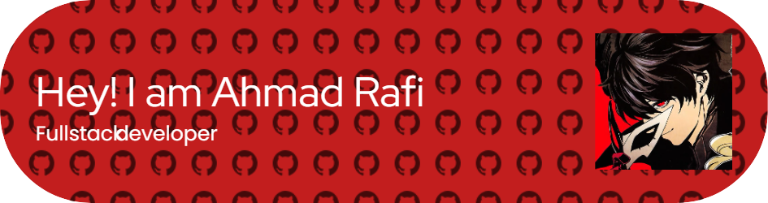

<h3 align="center">A passionate Fullstack Developer from Indonesia</h3>

  

  

- 🔭 I’m currently working on **Hadirify Project**

- 🌱 I’m currently learning **Laravel 12**

- 👨‍💻 All of my projects are available at [https://luciannz.netlify.app/](https://luciannz.netlify.app/)

- 📫 How to reach me **ahmadrafifadilah50@gmail.com**

- ⚡ Fun fact **I like to sleep with my cats**

<h3 align="left">Connect with me:</h3>

<h3 align="left">Languages and Tools:</h3>

                 

&nbsp;

###

  
  
  
  
  

###

  
  
  
  
  

###

<picture>
  <source media="(prefers-color-scheme: dark)" srcset="https://raw.githubusercontent.com/Raiyll/Raiyll/main/output/pacman-contribution-graph-dark.svg">
  <source media="(prefers-color-scheme: light)" srcset="https://raw.githubusercontent.com/Raiyll/Raiyll/main/output/pacman-contribution-graph.svg">
  
</picture>

